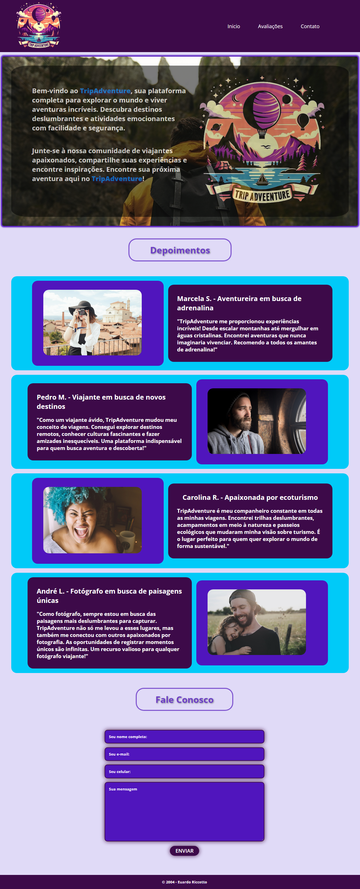

Clique aqui para alterar o idioma:

 

# TripAdventure

O projeto **TripAdventure** é um layout de site que se concentra em oferecer uma experiência envolvente e informativa sobre viagens. Desenvolvido em ReactJS, o site apresenta uma navegação fluida e responsiva, facilitada pelo React Router. Além disso, para enriquecer a experiência do usuário, utiliza animações suaves e interativas fornecidas pela biblioteca Framer Motion. A inclusão da biblioteca React Scroll permite uma rolagem suave e intuitiva em toda a página, aprimorando a acessibilidade e a usabilidade do site. Com ícones visualmente atrativos provenientes da biblioteca React Icons, o projeto visa transmitir uma sensação de aventura e descoberta aos visitantes do site. Por meio deste projeto, o objetivo é inspirar e informar os usuários sobre destinos de viagem emocionantes e experiências memoráveis ao redor do mundo.

 

:computer: [Clique aqui para acessar a aplicação](https://trip-adventure.vercel.app/)

 

 

## Tecnologias

 

## Dependencias:

- framer-motion;
- react;
- react-dom;
- react-icons;
- react-router-dom;
- react-scroll;

## Começando

Este projeto pode ser usado em sua própria máquina após realizar um **PUSH** deste repositório.

### `npm install`

Para baixar e atualizar todas as bibliotecas e dependências do projeto

### `npm start`

Executa aplicativo em modo desenvolvimento.\
Abra [http://localhost:3000/](http://localhost:3000/) para vizualizá-lo em seu navegador.

A pagina será recarregada quando você fizer alterações.\
Você também pode ver quaisquer erros de lint no console.

## Contato

  
   
  
   

